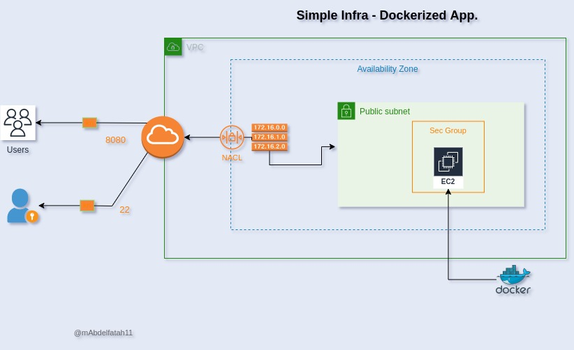

## Demo 1: Automate infrastructure creation for a Dockerized App

In this demo, we are going to:
- Use terraform IAC for Infrastructure creation, provisioning and on top of it Deploying a simple docker packaged App. on aws ec2 instance.
- test Application access through specified open ports - ssh for admin-ip and browsing for users.

### Overview

check our Demo Architecture diagram:


It has some components make up its architecture:
- Core infra: VPC - Public Subnet - internet Gateway - Routing Table
- server & attachments: EC2-instance - Security group

### Pre-requisites

* Terraform installed
* AWS cli installed on a host 
* AWS credentials configured properly in aws cli.
	
## Instructions

the following are instructions to deploy this terraform project using *[main.tf](main.tf) file resources:

### Deployment Instructions - EC2 Instances

* Clone this repository.
* create your own variables file ```terraform.tfvars``` to match any unique values you want to apply to your script *[main.tf](main.tf).
* Generate a keyPair, and move it to ```.ssh``` folder:
     ```
     ssh-keygen -t rsa -f ~/.ssh/key_name
     ```
	- keyPair will be used for ssh into server.
	- public key ```key-name.pub``` file location can be referenced later on the ```aws_keypair``` resource using ```public_key``` parameter.
	- private key ```key_name``` file, read only file, use it to ssh into server.

* Create ```entry-script.sh``` , use it to install docker and spin up docker container from your own app. docker image, then refer to the script file location in the ```aws_instance``` resource using ```user_data``` parameter.

* Run a ```terraform init``` to grab providers and modules.
* follow up using *[main.tf](main.tf) file to check each resource structure.
* Run a ```terraform paln``` to check you current and desired state.
* Run a ```terraform apply``` then check and confirm creation of your desired infrastructure.

* Try to ssh into server using its public ip:
     ```
     ssh ec2-user@public-ip
     ```
* Browse your application to check if the container was created successfully:
     ```
     public-ip:8080
     ```
