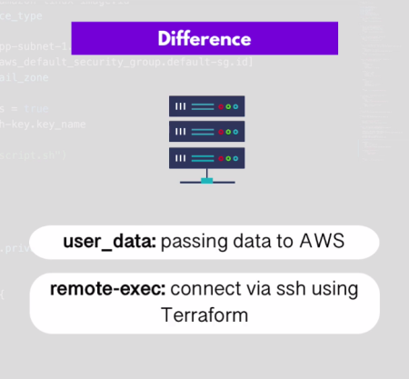
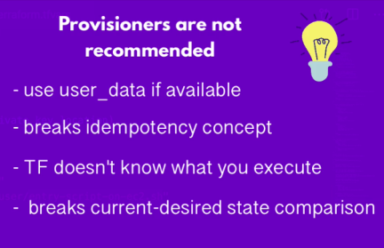

## Demo 1: Automate infrastructure creation for a Dockerized App

In this learning section, we are going to:
- Use provioners for remote cofig. execution
- differentaite between using user_data and provisioner for remote exec.

### Pre-requisites

AS on demo-1:
* Terraform installed
* AWS cli installed on a host 
* AWS credentials configured properly in aws cli.
	
## Instructions

* following the same identical instructions in demo-1: *[Readme-demo-1.tf](feature/create-aws-IAC-for-dockerized-app/1__Demo-1__create-aws-IAC-for-dockerized-app/README.md), we are going to add the provisioners feature to the same demo, in order to test the process.


### Outcomes

*After applying terraform main file, we can differnetiate between ```use_data``` and ```provisioner``` with a specific keywords



* However, Provisioner is not recommended on most of its uses from Terraform docs [terrafrom docs](https://www.terraform.io/language/resources/provisioners/syntax)




> Provisioners

* it is important to note that provisioner is more provisioned function for executing remote scripts but it has not recommended yet "issue discussed later"
but for now, it is a helpful function rather than "user_data" because user-data only "passes" the commands to the remote server after creation, so u are not aware if this commands got executed or not
* terraform does not let u know what happened, it just tells u that resource created succeffuly, but,
provisioners help u know more about script, it is like when u ssh to a remote server to execute commands so it is more provisioned tha user-data
if the provisioner function is not executed successfully, whole resource will marked as fail after issuing ```$ terraform apply```, so it let u know!!

> Why provisioner is not recommended?

* it breaks the base idea of terraform "current-desired state comparison", if u executed the script for the first time in the server, terraform does not not actually know what you have done there, becaue you have copied the script from local to the remote then executed it there, for the next time, TF can not compare current state in the server with the desired state, it does not actually know what happened there.
* for user-data, terraform "hashes" and "pass" it to the server, so next time it will compare the current hash with the new hash, if the new hash id differ from current one, then TF will execute the user-data again to apply the changes.

In general, for the best practices, you can use terraform for ```provisioning infrastructure```, and use Ansible tool for ```configuration managment``` for remote servers like issuing commands, installing utilities and others, so config. management tools are more efficient for config. purpose.
so, you can use provioner "local-exec" function for local provisioning or something like that.
but, as much as possible and in most cases try using user-data first and use provisioners only if there is no other option.

