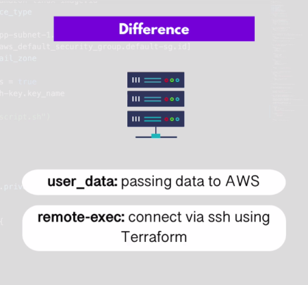
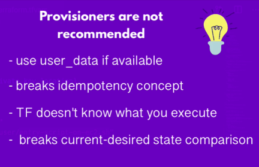

## Demo 1: Automate infrastructure creation for a Dockerized App

In this learning section, we are going to:
- Use provioners for remote cofig. execution
- differentaite between using user_data and provisioner for remote exec.

### Pre-requisites

AS on demo-1:
* Terraform installed
* AWS cli installed on a host 
* AWS credentials configured properly in aws cli.
	
## Instructions

* following the same identical instructions in demo-1: *[Readme-demo-1.tf](feature/create-aws-IAC-for-dockerized-app/1__Demo-1__create-aws-IAC-for-dockerized-app/README.md), we are going to add the provisioners feature to the same demo, in order to test the process.


### Outcomes

*After applying terraform main file, we can differnetiate between ```use_data``` and ```provisioner``` with a specific keywords



* However, Provisioner is not recommended on most of its uses from Terraform docs ![terraform.com]


