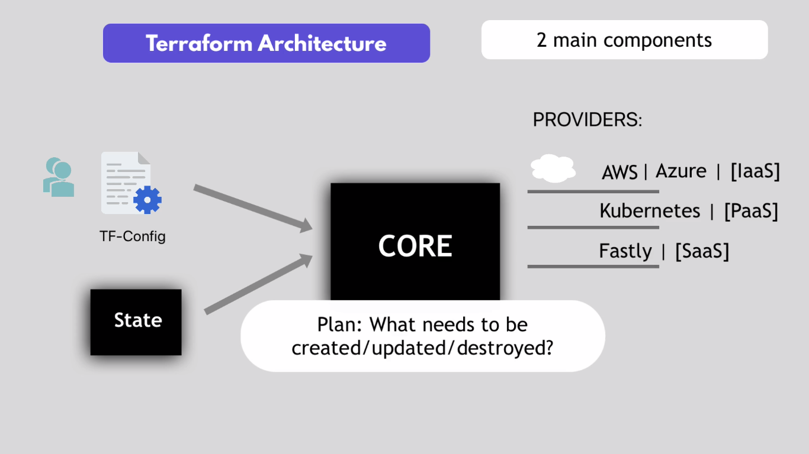

## Terraform Learn with Demos 

In this project, we'll start using Terraform technology along with some practical Demos:
- We will learn basic concepts related to Terraform
- Try doing some hands-on demos, each Demo created in an isolated branch while working on, then merged to main.

### inroduction
For an Automated Infrastructure Provisioning We are going to use a common IAC tool "Terraform" which:
- Automate and manage your infrastructure. 
- Open source, Declarative, and universal IAC tool which supports different cloud providers & different technologies

> #### How does terraform work?

check Terraform Architecture:

It has two main components make up its architecture:
- Core: Find out what to do - "compare, plan and execute" by tracking 'state' and applying the required configs 'main.tf'.
- Providers: This gives you the ability to build infrastructure in an easy way.
	
## Instructions

the following are instructions that anyone can use to deploy a terraform project,
also try to follow up using *[main.tf](main.tf) file to test the below instructions:

> ### initialize

    $ terraform init

- like installing dependencies in other programming projects
- will install provider and all the required components in the script

	
> ### preview terraform actions

    $ terraform plan

- compare the desired state with the actual current state of configs, so it will show you what is going to be applied upon the current configs.

> ### apply config.tf file

    $ terraform apply         
    $ terraform apply -auto-approve
- for applying changes in the main.tf script and review changes.
- use the second option for going ahead without asking for confirmation

    
> ### apply configuration with variables

    $ terraform apply -var-file terraform-dev.tfvars

- by default, when issuing apply command, it will looks for the variables file with exact file name called: terraform.tfvars, but if it was in another name like: terraform-dev.tfvars, it could not recognize it, so we should manually pass the vars file

> ### destroy everything from tf files

    $ terraform destroy

> ### destroy a single resource

    $ terraform destroy -target aws_vpc.myapp-vpc

- The most efficient way if you want to delete a specific resource is to remove the configurations of that resource or comment them out in the script then issue the command > terraform apply   
- So if you are working in a team, everyone should know that this resource has been deleted, but
- If you try > Terraform destroy, the config section of the destroyed resource will remain in the config.tf file, and it will cause a conflict for anyone who sees the configs for the first time, but
- you can issue the > terraform plan command to check the differnece between the configs and the current state
        

> ### show resources and components from current state with "tfstate" file

    $ terraform state list

- tfstate file: track the current state of the provider resources, file created after first apply command 
- state list: lists all the resources in the current state on aws, resources which created after last apply command

> ### show current state of a specific resource/data

    $ terraform state show aws_vpc.myapp-vpc

- Instead of navigating to the aws gui to see all attributes of a particular resource you can see any attribute from the state command
- Note: There are attributes that are automatically generated by aws, so the state file has all this information, so you can get the resource id, ip address, arn etc

        
> ### set avail_zone as custom tf environment variable - before apply

    export TF_VAR_avail_zone="eu-west-3a"   

